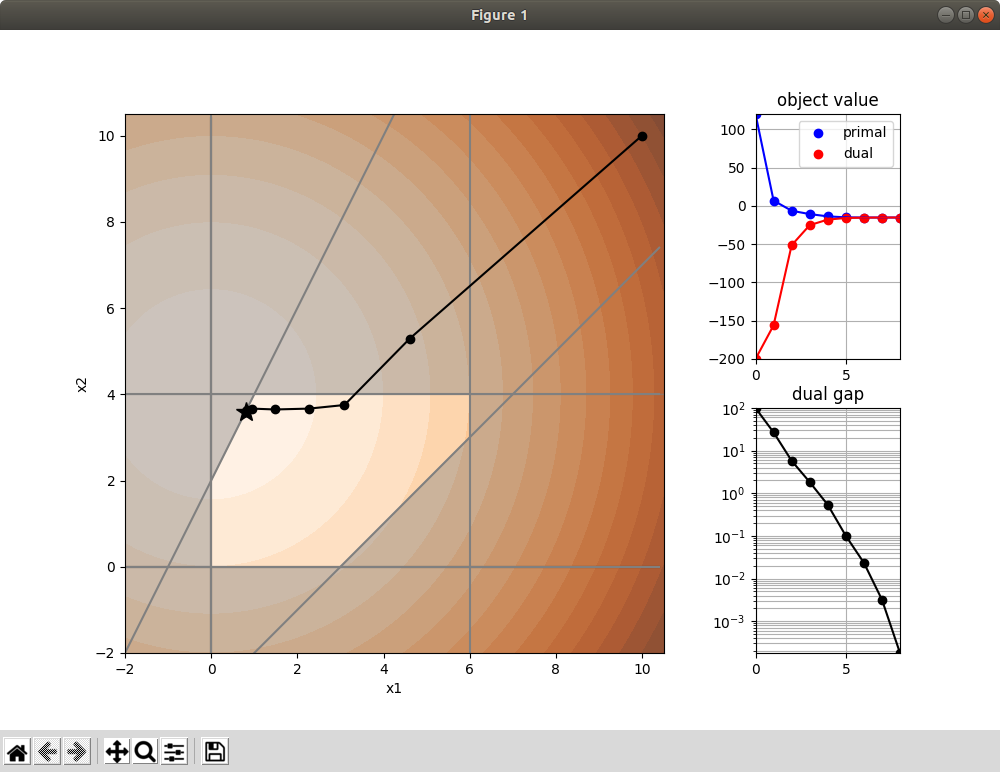
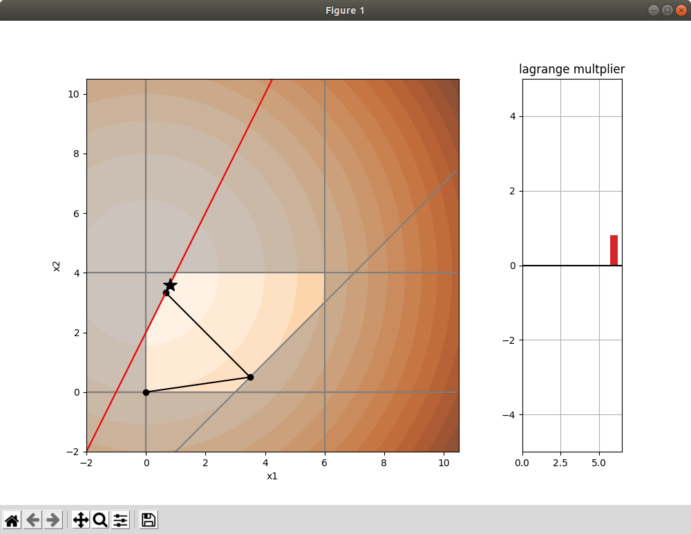
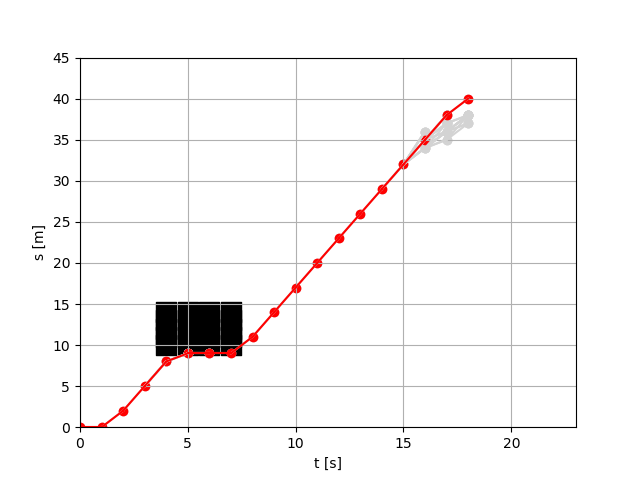
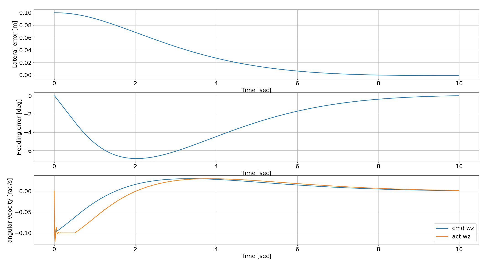
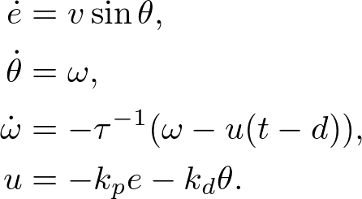

# Requirements


Managed by `pipenv`.
```
$ pip install pipenv
$ pipenv install
```

# Contents


## convex_optimization_algorithms

### prinam dual interpoint method

```
pipenv run python convex_optimization_algorithms/primal_dual_interpoint/primal_dual_interpoint.py
```

<p align="center">
  
</p>

### prinam dual interpoint method

```
pipenv run python convex_optimization_algorithms/active_set/active_set.py
```

<p align="center">
  
</p>


## A* based speed planner

A* based speed planning test in t-s space.


```
$ pipenv run python astar_velocity_planning/astar_speed_planner.py
```


 - Black : Obstacle occupied area
 - Red : Optimal path
 - Gray : Candidates

 


### Reference

[Lim, Wonteak & Lee, Seongjin & Sunwoo, Myoungho & Jo, Kichun. (2018). Hierarchical Trajectory Planning of an Autonomous Car Based on the Integration of a Sampling and an Optimization Method. IEEE Transactions on Intelligent Transportation Systems. 19. 1-14.](https://www.researchgate.net/publication/322202031_Hierarchical_Trajectory_Planning_of_an_Autonomous_Car_Based_on_the_Integration_of_a_Sampling_and_an_Optimization_Method)


## stop_dist_calc_w_jerk_acc_constraint

### calc_to_generate_csv

calculate stop dist and generate csv.

```
$ pipenv run python stop_dist_calc_w_jerk_acc_constraint/calc_to_generate_csv.py
```

### calc_with_plots
calculate stop dist and plot the result.

```
$ pipenv run python stop_dist_calc_w_jerk_acc_constraint/calc_with_plots.py
```


## Path Following Sim
### sim_1d_time_delay.py

```
$ pipenv run python ./path_following_sim/sim_1d_time_delay.py
```

<p align="center">
  
</p>


#### model

Path following error dynamics with `time_delay: tau` and `time_constant: d`

<p align="left">
  
</p>

#### args

`-h` shows help for usage.

```
$ pipenv run python3 ./path_following_sim/sim_1d_time_delay.py -h

usage: sim_1d_time_delay.py [-h] [-D] [-v VELOCITY] [-d TIME_DELAY]
                            [-t TIME_CONSTANT] [-kp P_GAIN] [-kd D_GAIN]

optional arguments:
  -h, --help            show this help message and exit
  -D, --sim_with_delay  set if sim with delay time is needed
  -v VELOCITY, --velocity VELOCITY
                        sim parameter: velocity
  -d TIME_DELAY, --time_delay TIME_DELAY
                        sim parameter: delay time
  -t TIME_CONSTANT, --time_constant TIME_CONSTANT
                        sim parameter: time constant
  -kp P_GAIN, --p_gain P_GAIN
                        sim parameter: p gain
  -kd D_GAIN, --d_gain D_GAIN
                        sim parameter: d gain
```
