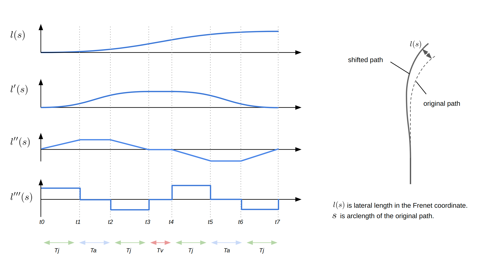

# Lane-Change-Path-Shifter


<p align="center">
  
</p>


```math
\begin{align}
l_1&= \frac{1}{6}jT_j^3\\[10pt]
l_2&= \frac{1}{6}j T_j^3 + \frac{1}{2} j T_a T_j^2 + \frac{1}{2} j T_a^2 T_j\\[10pt]
l_3&= j  T_j^3 + \frac{3}{2} j T_a T_j^2 + \frac{1}{2} j T_a^2 T_j\\[10pt]
l_4&= j T_j^3 + \frac{3}{2} j T_a T_j^2 + \frac{1}{2} j T_a^2 T_j + j(T_a + T_j)T_j T_v\\[10pt]
l_5&= \frac{11}{6} j T_j^3 + \frac{5}{2} j T_a T_j^2 + \frac{1}{2} j T_a^2 T_j + j(T_a + T_j)T_j T_v \\[10pt]
l_6&= \frac{11}{6} j T_j^3 + 3 j T_a T_j^2 + j T_a^2 T_j + j(T_a + T_j)T_j T_v\\[10pt]
l_7&= 2 j T_j^3 + 3 j T_a T_j^2 + j T_a^2 T_j + j(T_a + T_j)T_j T_v
\end{align}
```

加速度制限 $a_{lim}$ を導入する必要があるか確認。

### 時間ベースでやる場合

トータルの車線変更時間 $T$ と横移動距離 $L$ から、 $T_a=T_j=0$ として $l_7=L$ を計算すると、 $j=\frac{32L}{T^3}$ と求まる。また、 $T_j=T/4$ より $a_{max} = jT_j= \frac{8L}{T^2}$ となる。この値が最大加速度制約を超えていた場合は、加速度一定時間 $T_a$ を導入する。

このとき、 $T_v=0$ として $l_7=L,\ j=a_{lim}/T_j,\ 4t_j+2T_a=T$ の情報から、 $T_j=\frac{T}{2} - \frac{2L}{aT}$, $T_a=\frac{4L}{aT} - \frac{T}{2}$, $j=\frac{2a^2T}{aT^2-4L}$ を得る。これを使って $l_i$ を計算する。
