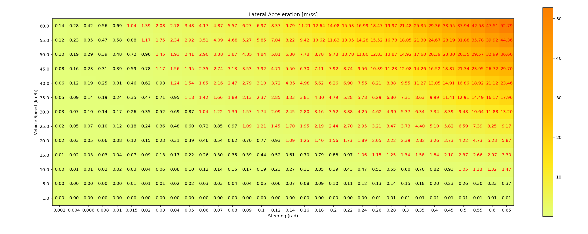
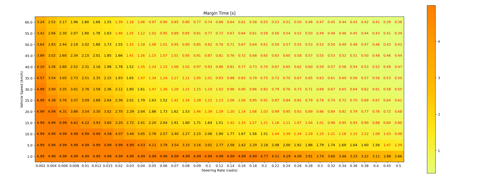

# steering limit evaluation

This code calculates the permissible steering angle for each vehicle speed based on the lateral acceleration threshold. The results are provided in the form of a 2D plot, showing the lateral acceleration for each velocity and steering angle.

## Given parameters

- wheelbase
- margin_latacc_threshold

## Output

```sh
$ python3 steer_limit_evaluation.py
```

Example: The grid displays the lateral acceleration [m/ss] for various vehicle speeds [km/h] and steering angle [rad]. A threshold of 1.5 [m/ss] is set, and any value over this threshold is highlighted in red.



This is calculated with the following parameter:

```py
wheelbase = 4.0  
margin_latacc_threshold = 1.0
```

# steering rate limit evaluation

This code calculates the permissible steering rates for each vehicle speed based on the given vehicle shape and the lateral distance to obstacles. The results are provided in the form of a 2D plot, showing the time until collision with an obstacle for each vehicle speed and steering rate value.

Simulation is performed with simple bicycle kinematics model with 4th order Runge-Kutta.

## Given parameters

- wheelbase
- vehicle width
- vehicle length
- margin distance (distance to a lateral obstacle)

## Output

```sh
$ python3 steer_rate_limit_evaluation.py
```

Example: The grid displays the margin time [s] before collision with obstacles for various vehicle speeds [km/h] and steering rates [rad/s]. A threshold of 1.5 seconds is set, and any time below this threshold is highlighted in red.



This is calculated with the following parameter:

```py
wheelbase = 4.0  # length of the vehicle (m)
vehicle_length = 5.0  # length of the vehicle (m)
vehicle_width = 2.0  # width of the vehicle (m)
margin_distance = 1.0  # lateral distance to move before stopping the simulation (m)
```
